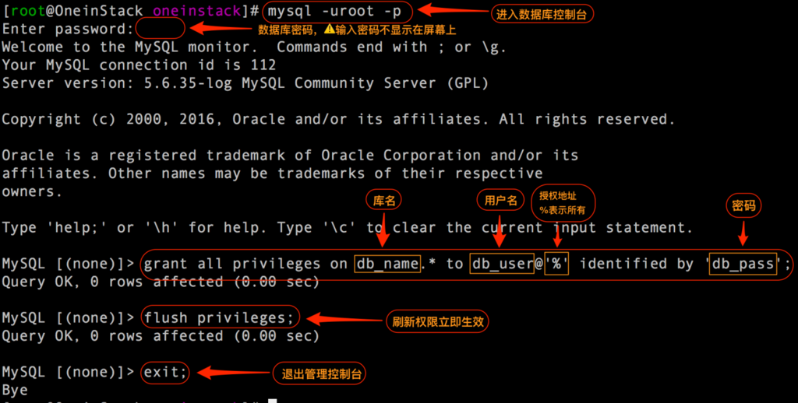

# mysql的学习心得

[](https://github.com/livissnack)

#### 开启服务
mysqld

#### 登录
mysql -u root -p password -P 3306 -h localhost

#### 查看所有数据库
show databases;

#### 切换数据库
use ```da_name```;

#### 查看所有表
show tables;

#### 查看所有行信息
show columns from ```table_name```;

#### 查看表的详情
describe ```table_name```

#### 判断数据库不存在后创建数据库
create database if not exists ```name```;

#### 判断是数据表不存在后创建数据表
create table if not exists ```table_name```(
  ```column_name``` ```column_type```,
  ...
);

#### 行的类别
int
标准SQL中有*```INTEGER```*&*```SMALLINT```*，MYSQL中有:

| type        | bytes   |
| ------------|:-------:|
| TINYINT     | 1       |
| SMALLINT    | 2       |
| MEDIUMINT   | 3       |
| INT/INTEGET | 4       |
| BIGINT      | 8       |

显示长度
* 例如写```TINYINT(4)```表示显示4位，```TINYINT```有符号时最大为-128，且符号占1，长度为4

* 写上 ```INT(4)```, 插入一个长度为5的 11111, 依然可以正常显示出来


#### 创建数据库用户并授权
```
    grant all privileges on db_name.* to db_user@'%' identified by 'db_password';   创建数据库用户并授权
    flush privileges; 刷新用户权限
```


#### 退出数据库，重启
```
    exit
    sudo service mysql restart
```

#### mysql默认只允许本地登录，修改配置文件
```
    因此需要修改配置文件将地址绑定注释掉：
    配置文件路径 /etc/mysql/mysql.conf.d/mysqld.cnf
    
    # Instead of skip-networking the default is now to listen only on  
    # localhost which is more compatible and is not less secure.  
    #bind-address       = 127.0.0.1     #注释掉此行就可以远程登录了
```

#### mysql数据导出
```
    mysqldump -uroot -pmysql databasefoo table1 table2 > foo.sql 
    
    这样就可以将数据库databasefoo的表table1,table2以sql形式导入foo.sql
    中,其中-uroot参数表示访问数据库的用户名是root,如果有密码还需要加上-p参数 
```

#### mysql数据导入
```
    mysql -uroot databasefoo < foo.sql 
    
    这样就可以将foo.sql的数据全部导入数据库databasefoo 
    
    常用source 命令： 
    　　进入mysql数据库控制台， 
    　　如mysql -u root -p 
    　　mysql>use 数据库 
    　　然后使用source命令，后面参数为脚本文件(如这里用到的.sql) 
    　　mysql>source d:wcnc_db.sql
```